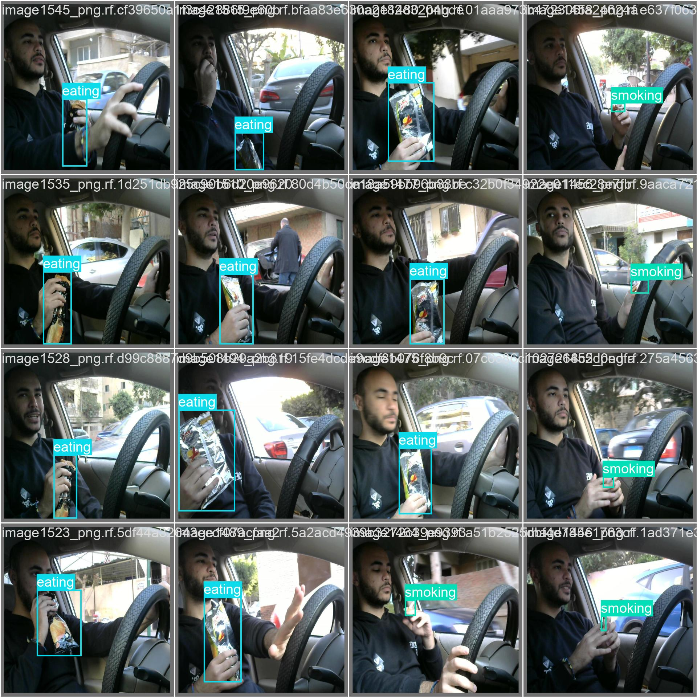

## [YOLOv11 (You Only Look Once, v11)](https://arxiv.org/abs/2410.17725)
In this project, I used **Ultralytics YOLOv11** as the implementation. YOLOv11 is a single-stage object detector designed for real-time performance, predicting bounding boxes and class probabilities in a single pass over the image. This version introduces architectural improvements such as C3k2, SPPF, and C2PSA blocks to enhance feature extraction and efficiency. Ultralytics provides multiple model sizes (e.g., nano, small, medium, large, extra-large) to balance accuracy and speed depending on the available computational resources. YOLOv11 also supports multi-task capabilities beyond detection, including segmentation, classification, and keypoint detection. Its combination of strong accuracy and relatively fast inference makes it a versatile choice for practical applications.  

## [SSD (Single Shot MultiBox Detector)](https://arxiv.org/abs/1512.02325)
In this project, I used **PyTorch’s SSD300 with VGG16 backbone** as the SSD implementation. SSD is a single-stage object detector that uses multiple feature maps at different resolutions to detect objects of varying sizes. It is generally faster than two-stage models and more lightweight, which makes it suitable for mobile and embedded applications. However, SSD often sacrifices some accuracy, especially for small or densely packed objects, when compared to more complex detectors.  

## [Faster R-CNN](https://arxiv.org/abs/1506.01497)
For this project, I used **PyTorch’s Faster R-CNN with ResNet50-FPN v2 backbone** as the implementation. Faster R-CNN is a two-stage object detector: the first stage generates candidate regions using a Region Proposal Network (RPN), and the second stage classifies these regions and refines their bounding boxes. This design achieves high detection accuracy, especially for small or overlapping objects. However, the additional region proposal step makes Faster R-CNN slower and more computationally expensive compared to single-stage models, which limits its practicality in real-time or resource-constrained environments.  

## Methodology
I used a [car object detection dataset](https://universe.roboflow.com/asu-b6mtv/mobile-detection-l2iov) from Roboflow to perform transfer learning on three models: **YOLOv11**, **SSD**, and **Faster R-CNN**. Before training, I modified the dataset by renaming the categories to nouns in order to better align with the final goal of this research. Each model was then trained for a duration of two hours, with parameters unfrozen to enable fine-tuning across all layers rather than limiting adjustments to only the final layers. After training, I evaluated the models on a separate test dataset and collected the results to compare their performance.  
  
Here are some example from the original training set:

  

## [Results](pretrain_models.ipynb)

The performance of the three models was evaluated on a **test dataset of 270 images** using **mAP50–95**, **total inference time (s)**, and **time per image (s)**. The results are summarized below:

| Model        | mAP50–95 | Total Time (s) | Time per Image (s) |
|--------------|----------|----------------|--------------------|
| YOLOv11      | 0.619530 | 44.522169      | 0.1649             |
| Faster R-CNN | 0.556220 | 352.644127     | 1.3061             |
| SSD          | 0.498391 | 32.049965      | 0.1187             |

### Interpretation
- **YOLOv11** achieved the **highest accuracy (mAP50–95 = 0.6195)** with an average inference time of **0.165s per image**, making it a strong balance of speed and accuracy.  
- **Faster R-CNN** provided **moderate accuracy (0.5562)** but was the **slowest**, requiring **1.306s per image**, which limits its practicality in real-time scenarios.  
- **SSD** was the **fastest model (0.119s per image)**, but it had the **lowest accuracy (0.4984)**, showing a clear trade-off between speed and precision.  

## Conclusion

The experiments demonstrate the trade-offs between accuracy and inference speed across the three models. **YOLOv11** provided the best balance, achieving the **highest accuracy (mAP50–95 = 0.6195)** with a relatively low inference time, making it suitable for real-time applications that still require strong precision. **Faster R-CNN** achieved **moderate accuracy (0.5562)** but at the cost of very high inference time, limiting its use to scenarios where accuracy is more important than speed, such as offline analysis. **SSD** was the **fastest model (0.119s per image)** but delivered the **lowest accuracy (0.4984)**, making it more appropriate for applications where speed is the primary concern and a slight reduction in accuracy is acceptable.  

Overall, **YOLOv11 emerges as the most balanced choice** for car object detection in this study, combining both efficiency and accuracy effectively.  
