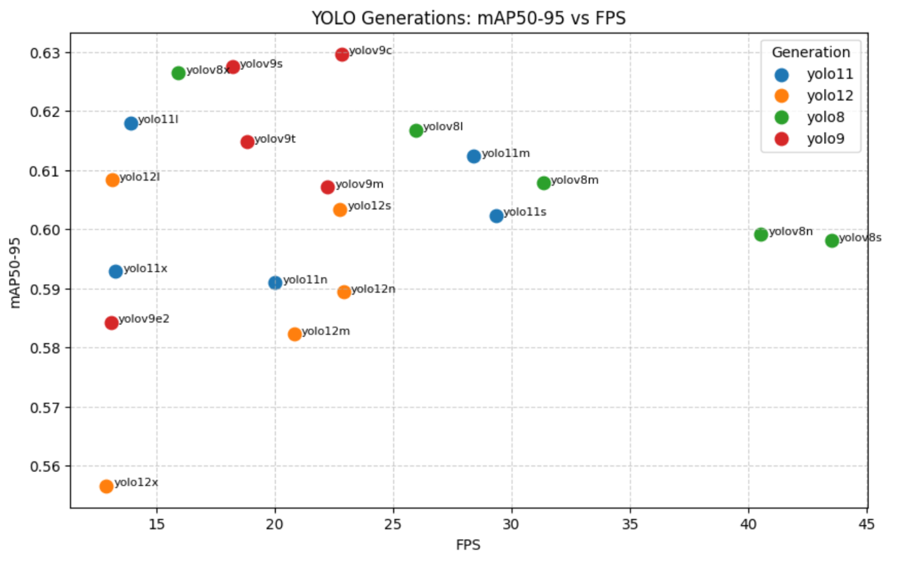

# YOLO Models Comparison on In-Cabin Dataset

## Overview
This section compares YOLOv8, YOLOv9, YOLOv11, and YOLOv12 architectures on the in-cabin dataset, considering their various sub-model sizes. The trade-off lies between computation time and accuracy, and newer models are not necessarily superior—each employs a different architecture. Therefore, testing all models is essential to determine which performs best on our dataset.

## Quick YOLO Models Summary
- **YOLOv8:** A versatile model featuring enhanced capabilities such as instance segmentation, pose/keypoints estimation, and classification.  
- **YOLOv9:** An experimental model trained on the Ultralytics YOLOv5 codebase implementing Programmable Gradient Information (PGI).  
- **YOLO11:** Delivering state-of-the-art (SOTA) performance across multiple tasks, including detection, segmentation, pose estimation, tracking, and classification.  
- **YOLO12 🚀 NEW:** Replaces traditional CNNs with an attention-centric architecture, achieving state-of-the-art detection accuracy while preserving real-time inference speed.  

## Methodology
I downloaded the pretrained weights for each model from Ultralytics and performed transfer learning on the in-cabin dataset. The final model will be chosen based on achieving a minimum of **0.6 mAP** and maintaining **25 FPS or higher**. I am not uploading the weights to this notebook, as some exceed **100 MB** and cannot be hosted on GitHub.

## Results

The models **YOLOv8l, YOLOv8m, YOLOv11s, and YOLOv11m** all satisfy the defined selection criteria, achieving both **mAP values above 0.6** and **inference speeds greater than 25 FPS** on the in-cabin dataset. These results indicate that each of these models provides a strong balance between detection accuracy and real-time performance, making them suitable candidates for further consideration and potential deployment.

## Real-Life Testing

In real-world tests, all models underperformed: they consistently failed to classify a **snack bag as food** and a **black phone as phone**. Among them, **YOLO11m** showed marginally better results, but the improvement was not sufficient to meet expectations.

## References
- [YouTube Demo](https://www.youtube.com/watch?v=MUZkTjd5ShM)  
- [Roboflow Project](https://universe.roboflow.com/asu-b6mtv/mobile-detection-l2iov)  
- [Ultralytics YOLO Documentation](https://docs.ultralytics.com/models/#featured-models)